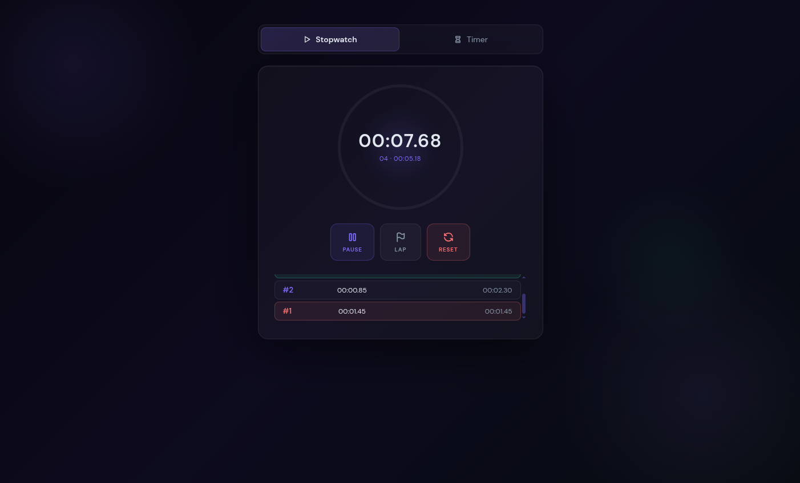
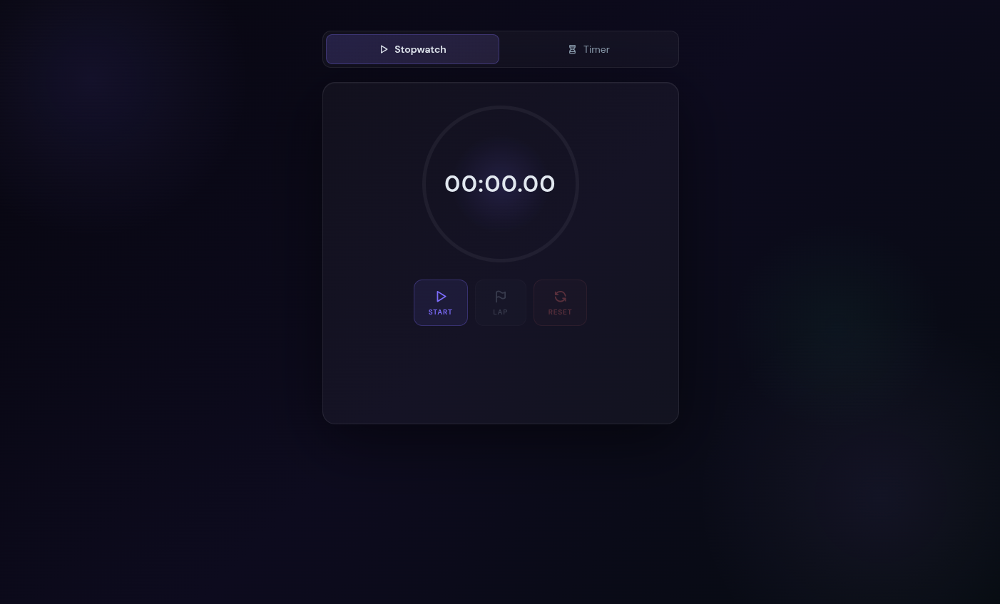
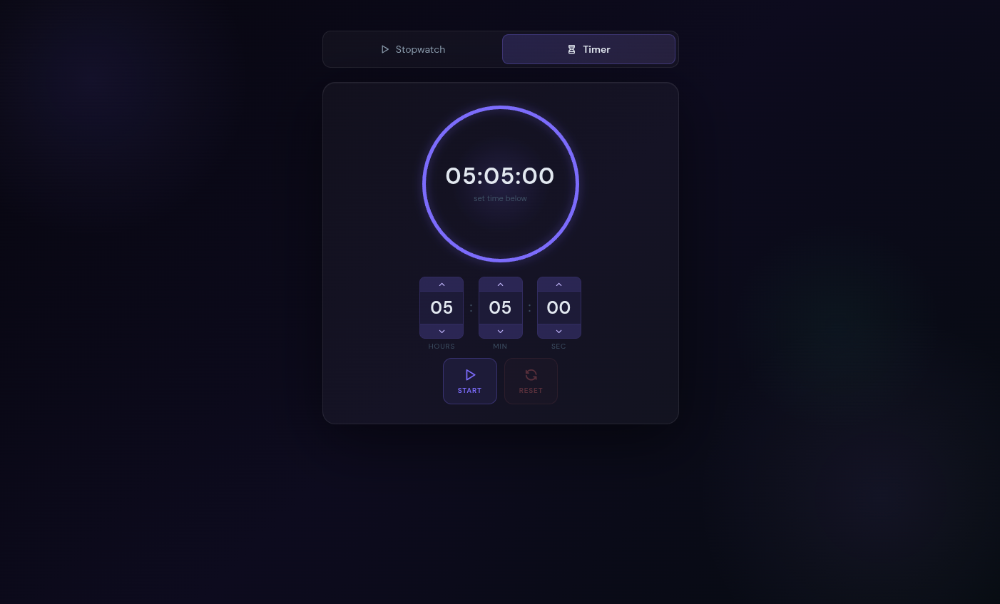
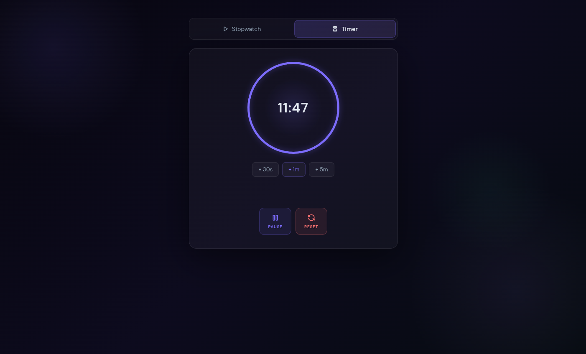

# ⏱ Timer App

A sleek, dark-themed **Stopwatch + Countdown Timer** built with React. Features a glowing ring progress indicator, lap tracking, and smooth animations — all in a single component file with zero external state libraries.






---

## Features

### Stopwatch
- Start, pause, and reset with millisecond precision
- **Lap tracking** with split times and cumulative totals
- Best lap highlighted in **green**, worst in **red**
- Smooth animated ring that completes every 60 seconds
- Thin accent-colored scrollbar on lap list (no white scrollbar)

### Countdown Timer
- Set hours, minutes, and seconds via **click-and-hold** or **scroll wheel**
- Quick-add buttons: **+30s**, **+1m**, **+5m** while running
- Ring drains as time counts down
- Turns **red** in the final 10 seconds
- Shows a ✓ **DONE** state when complete

### UI / Design
- Dark glassmorphism aesthetic with purple accent glows
- `Orbitron` font for digits, `DM Sans` for UI
- Fully responsive within a centered 500px card
- Accessible: `aria-label` and `aria-hidden` throughout

---

## 🚀 Getting Started

### Prerequisites
- Node.js ≥ 18
- npm or yarn

### Install & Run

```bash
git clone https://github.com/your-username/timer-app.git
cd timer-app
npm install
npm run dev
```

Then open [http://localhost:5173](http://localhost:5173) in your browser.

### Build for Production

```bash
npm run build
```

---

## 🗂 Project Structure

```
src/
├── App.jsx        # All components: Ring, Btn, LapRow, TimeInput, Stopwatch, Timer, App
├── main.jsx       # React DOM entry point
index.html         # Loads fonts (Orbitron, DM Sans) + Tabler Icons
```

---

## 🛠 Tech Stack

| Tool | Purpose |
|------|---------|
| [React](https://react.dev) | UI framework |
| [Vite](https://vitejs.dev) | Dev server & bundler |
| [Orbitron](https://fonts.google.com/specimen/Orbitron) | Numeric display font |
| [DM Sans](https://fonts.google.com/specimen/DM+Sans) | UI sans-serif font |
| [Tabler Icons](https://tabler.io/icons) | Icon set (webfont) |

No additional runtime dependencies — pure React hooks (`useState`, `useEffect`, `useRef`, `useCallback`) and `requestAnimationFrame` for smooth timing.

---

## ⌨️ Controls

| Action | How |
|--------|-----|
| Start / Pause | Click the **Start / Pause** button |
| Record lap | Click **Lap** (only active while running) |
| Reset | Click **Reset** |
| Change timer value | Click ▲ / ▼ arrows or scroll the mouse wheel over a digit |
| Add time while running | Click **+30s**, **+1m**, or **+5m** |

---

## 📄 License

MIT — free to use, fork, and modify.
